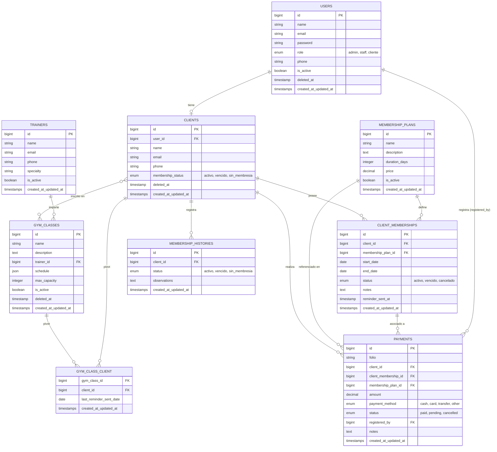

<p align="center">
  
  
  
  
  
</p>

<h1 align="center">💪 GymControl</h1>
<p align="center">Sistema de gestión para gimnasios — administración de clientes, membresías, pagos, clases y entrenadores.</p>

---

## 📋 Tabla de Contenidos

- [Descripción del Proyecto](#-descripción-del-proyecto)
- [Stack Tecnológico](#-stack-tecnológico)
- [Requisitos Previos](#-requisitos-previos)
- [Instalación y Configuración](#-instalación-y-configuración)
- [Credenciales de Prueba](#-credenciales-de-prueba)
- [Automatización (Tareas Programadas)](#-automatización-tareas-programadas)
- [Ejecutar Pruebas](#-ejecutar-pruebas)
- [Diagrama Entidad-Relación (DER)](#-diagrama-entidad-relación-der)
- [Estructura de Roles](#-estructura-de-roles)

---

## 📖 Descripción del Proyecto

**GymControl** es una aplicación web desarrollada con Laravel 12 para la gestión integral de un gimnasio. Permite a los administradores y staff gestionar:

- 👥 **Clientes** y sus perfiles
- 🏷️ **Planes de Membresía** (mensuales, anuales, etc.)
- 💳 **Membresías de Clientes** (activación, vencimiento, cancelación)
- 💰 **Pagos** con asignación automática de membresía al registrarse como pagado
- 🏋️ **Clases** y sus horarios semanales
- 🧑‍🏫 **Entrenadores**
- 📧 **Recordatorios automáticos por correo** (clases del día siguiente y membresías por vencer)

---

## 🛠 Stack Tecnológico

| Capa | Tecnología |
|------|-----------|
| Backend | PHP 8.2 + Laravel 12 |
| Auth & Perfil | Laravel Jetstream + Livewire |
| Base de Datos | MySQL 8.0 |
| Frontend | Blade + TailwindCSS 3 + Vite |
| UI Notificaciones | SweetAlert2 |
| Iconos | Font Awesome 6 |
| PDF | barryvdh/laravel-dompdf |
| Correo | SMTP (Gmail) |
| Testing | Pest PHP 3 |

---

## ✅ Requisitos Previos

- PHP >= 8.2 con extensiones: `mbstring`, `xml`, `pdo`, `mysql`, `curl`, `zip`
- Composer >= 2.x
- Node.js >= 18.x + npm
- MySQL >= 8.0
- Git

---

## 🚀 Instalación y Configuración

### 1. Clonar el repositorio

```bash
git clone https://github.com/Julian-estrella/gymcontrol.git
cd gymcontrol
```

### 2. Instalar dependencias PHP

```bash
composer install
```

### 3. Instalar dependencias Node

```bash
npm install
```

### 4. Configurar el archivo de entorno

```bash
cp .env.example .env
php artisan key:generate
```

Edita `.env` con tus credenciales:

```dotenv
APP_NAME=GymControl
APP_URL=http://localhost:8000
APP_TIMEZONE=America/Mexico_City

DB_CONNECTION=mysql
DB_HOST=127.0.0.1
DB_PORT=3306
DB_DATABASE=gymcontrol
DB_USERNAME=root
DB_PASSWORD=

MAIL_MAILER=smtp
MAIL_HOST=smtp.gmail.com
MAIL_PORT=587
MAIL_USERNAME=tu_correo@gmail.com
MAIL_PASSWORD="tu_app_password"
MAIL_ENCRYPTION=tls
MAIL_FROM_ADDRESS="notificaciones@gymcontrol.com"
MAIL_FROM_NAME="GymControl"
```

### 5. Crear la base de datos

```sql
CREATE DATABASE gymcontrol CHARACTER SET utf8mb4 COLLATE utf8mb4_unicode_ci;
```

### 6. Ejecutar migraciones y seeders

```bash
php artisan migrate --seed
```

### 7. Crear enlace de almacenamiento

```bash
php artisan storage:link
```

### 8. Iniciar el servidor de desarrollo

En tres terminales separadas (o usando el script de composer):

```bash
# Terminal 1 — Servidor PHP
php artisan serve

# Terminal 2 — Compilador de assets
npm run dev

# Terminal 3 — Worker de colas (para envío de correos en background)
php artisan queue:listen --tries=1
```

O todo en uno con:

```bash
composer run dev
```

La aplicación estará disponible en: **http://localhost:8000**

---

## 🔑 Credenciales de Prueba

> Todas las cuentas usan la misma contraseña: **`password`**

| Rol | Correo | Acceso |
|-----|--------|--------|
| **Administrador** | `admin@gymcontrol.com` | Panel completo (usuarios, clientes, membresías, pagos, clases, entrenadores) |
| **Staff / Operador** | `staff@gymcontrol.com` | Panel admin sin gestión de usuarios |
| **Cliente / Miembro** | `cliente@gymcontrol.com` | Vista de Mi Espacio Gym |

---

## ⏰ Automatización (Tareas Programadas)

GymControl incluye dos comandos Artisan que se ejecutan diariamente mediante el scheduler de Laravel:

| Hora | Comando | Descripción |
|------|---------|-------------|
| 08:00 | `memberships:send-expiration-reminders` | Envía correo a clientes cuya membresía vence en los próximos 3 días |
| 09:00 | `classes:send-reminders` | Envía recordatorio a clientes inscritos en clases programadas para mañana |

### Activar el Scheduler (producción)

Agrega esta línea al cron del servidor:

```cron
* * * * * cd /ruta/al/proyecto && php artisan schedule:run >> /dev/null 2>&1
```

### Ejecutar manualmente (desarrollo/pruebas)

```bash
# Recordatorios de membresías por vencer
php artisan memberships:send-expiration-reminders

# Recordatorios de clases del día siguiente
php artisan classes:send-reminders
```

---

## 🧪 Ejecutar Pruebas

El proyecto usa **Pest PHP** con base de datos SQLite en memoria.

```bash
# Ejecutar todas las pruebas
vendor/bin/pest

# Ejecutar un archivo de pruebas específico
vendor/bin/pest tests/Feature/ClassReminderTest.php
vendor/bin/pest tests/Feature/AuthenticationTest.php
vendor/bin/pest tests/Feature/ClientMembershipManagementTest.php
vendor/bin/pest tests/Feature/AdminValidationsTest.php
```

### Suites de Pruebas

| Archivo | Descripción |
|---------|-------------|
| `AdminValidationsTest.php` | Validación de formularios admin (usuarios, clientes, pagos, etc.) |
| `AuthenticationTest.php` | Login, contraseña incorrecta, redirección por rol |
| `ClientMembershipManagementTest.php` | Asignación de membresía en pago, desactivación y cancelación |
| `ClassReminderTest.php` | Envío de recordatorios de clase (sin duplicados) |

---

## 🗃️ Diagrama Entidad-Relación (DER)



---

## 🔐 Estructura de Roles

```
Admin ──────── Acceso total al panel administrativo
                ├── Gestión de Usuarios
                ├── Gestión de Clientes
                ├── Planes de Membresía
                ├── Membresías de Clientes
                ├── Pagos
                ├── Clases
                └── Entrenadores

Staff ──────── Acceso al panel sin gestión de usuarios
                ├── Gestión de Clientes
                ├── Membresías de Clientes
                ├── Pagos
                ├── Clases
                └── Entrenadores

Cliente ─────── Mi Espacio Gym (solo lectura de su info)
```

---

## 📄 Licencia

Este proyecto es de uso académico/personal. Desarrollado como proyecto final de desarrollo backend.
